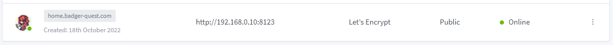
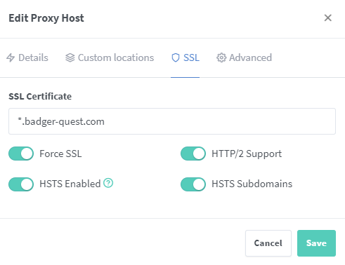
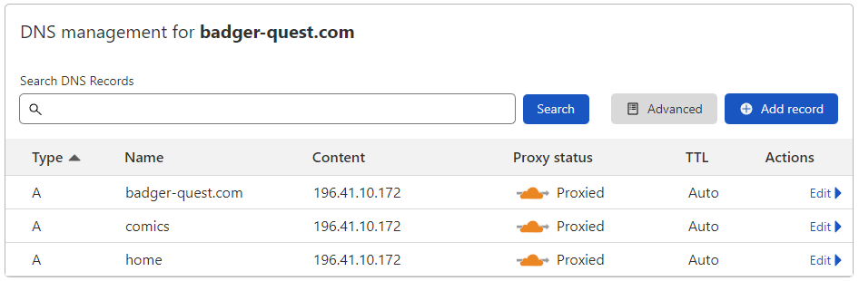

# Home Assistant, Part 2: Remote Access

In order to become the over lord of my house no matter which network I’m connected to, I need to expose my Home Assistant instance remotely.

<!-- Table of Contents -->

## Nginx Proxy Manager host entry

Add the following Nginx host entry:

## Cloudflare subdomain entry

### Firewall Rule

sudo ufw allow 8123

Rule added  
Rule added (v6)

## Conclusion

text

## References

1. [https://community.home-assistant.io/t/docker-network-mode-host-and-container-discovery/218448/11](https://community.home-assistant.io/t/docker-network-mode-host-and-container-discovery/218448/11)
