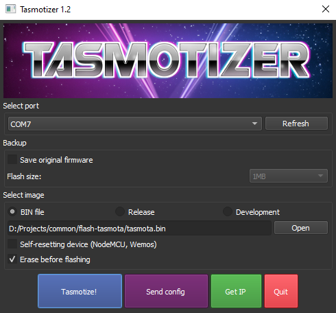

# Tasmota, Part 1: Setup and Initial Configuration

Tasmota is open source firmware designed for the ESP wifi chip series in order to give them MQTT functionality. Tasmota will give us a standard for any ESP defice connected to the home network.

> This article will cover flashing Tasmota and accessing it’s WebUI. For further related Tasmota articles, take a look at:
>
> * [home-assistant](/wiki/label/home-assistant)
> * [mqtt](/wiki/label/mqtt)
<<<<<<< HEAD



=======

<!-- Table of Contents -->

>>>>>>> b3a8580de101a250de03d8c59337b640d73bf8c9
## Flashing Tasmota

Let’s take a look at what’s required for flashing Tasmota onto an ESP device.

### Required components

In order to flash Tasmota onto an ESP chip, we’ll require the following components:

* FTDI board
* Jumper cables
* ESP8266 board

For this article, I used the following:

* [https://www.mantech.co.za/ProductInfo.aspx?Item=15M0301-A](https://www.mantech.co.za/ProductInfo.aspx?Item=15M0301-A) - R76.72
* [https://www.mantech.co.za/ProductInfo.aspx?Item=15M8769](https://www.mantech.co.za/ProductInfo.aspx?Item=15M8769) - R64.43

### Tasmota firmware

The FTDI board will be used to flash the Tasmota firmware onto the the ESP-01 chip. In order to flash the firmware, we’ll also need to download:

1. **Tasmota Firmware**  
    Download the latest `tasmota.bin` file from the following link[http://ota.tasmota.com/tasmota/release/](http://ota.tasmota.com/tasmota/release/)
    
2. Tasmotizer flashing software  
    Download the tasmotizer installation from the following link [https://github.com/tasmota/tasmotizer/releases](https://github.com/tasmota/tasmotizer/releases)
    

### Wiring Configuration

In order to flash the ESP-01 chip, we need to connect the relevant pins to the FTDI chip.

The ESP chip is strictly rated for 3.3V. Anything higher than that will damage the chip

The ESP chip requires a 3.3V input. The FTDI board that I’m using can be set to 3.3V mode by connecting the following two pins 3.3V and the center pin as shown on the right.

The FTDI module needs to be able to supply at least 300mA. This one should be able to supply 500mA.


The ESP board will be connected to the breakout pins of the FTDI board. The FTDI board has a mini USB port which we’ll connect to a PC so that we can flash the chip with Tasmotizer.

**Connect the FT232RL to the ESP-01S as follows:**

* ESP-01S GND → FT232 GND: Common Ground
* ESP-01S GPIO0 → FT232 GND: Boot into Programming Mode
* ESP-01S VCC → FT232 VCC: 3.3V
* ESP-01S CH\_PD → FT232 VCC: 3.3V
* ESP-01S RX → FT232 TX
* ESP-01S TX → FT232 RX

### Flashing the ESP board with Tasmotizer

With the wiring configuration above, connect the FT232RL to your PC with a mini USB to USB cable. Open up the Tasmotizer app. After the FT232RL has been connected, refresh the com port on Tasmotizer to ensure you’ve selected the correct one.

Select the tasmota bin directory as the image to flash and hit **Tazmotize**.



Wait for Tasmotizer to completely finish flashing the ESP chip and then disconnect the cables from:

* ESP-01S GPIO0 → FT232 GND: Remove so that device will boot normally
* ESP-01S CH\_PD → FT232 VCC: 3.3V

The only remaining connections should then be:

* ESP-01S GND → FT232 GND: Common Ground
* ESP-01S VCC → FT232 VCC: 3.3V
* ESP-01S RX → FT232 TX
* ESP-01S TX → FT232 RX

## Initial configuration

Now that Tasmota has been flashed onto the ESP chip, let’s take a look at first time configurations for Tasmota. Ensure that the ESP chip is still powered.

### Accessing the WebUI


Using any WiFi enabled device, search through the available WiFi networks for a network named tasmota-XXXXXX-XXXX.

After connecting to the tasmota local wifi, navigate to 192.168.4.1 to reach the Tasmota WebUI.

### Connect Tasmota to your WiFi Network

After connecting to the WebUI, you will be presented with a screen to configure network access for the Tasmota device.

Select the network you want to connect the device to and enter in your WiFi password. On a successful connection, the device will display a success message.


At this point the Tasmota network will no longer be available. Your device should automatically reconnect to it’s original network. The Tasmota device will now be available at it’s allocated IP address on it’s connected network.

If you miss the new IP address, use the IP scanning feature on RouterOS:

`Tools -> IP Scan -> Start`

Navigating to the allocated IP address of the tasmota device will direct you to the Tasmota WebUI:


### Set a static IP address

The Tasmota chip can store it’s own static IP address, or else the static IP can be set through your router.

Tasmota static IP address.

1. Log onto the Tasmota interface.
2. Navigate to the web console.
3. Enter the following command:

    ```bash
    IPAddress1 192.168.0.105
    ```

    The following lines should appear once the static IP has been set:

    ```log
    06:43:00.914 CMD: IPAddress1 192.168.0.105
    06:43:00.920 MQT: /misc/sitbit/stat/RESULT = {"IPAddress1":"192.168.0.105 (192.168.0.105)"}
    ```

### DHCP Entry

Log onto the RouterOS admin console and proceed with the following steps:

1. Navigate to **IP** → **DHCP Server** → **Leases**.
2. Locate the IP address of the Raspberry Pi hosting OctoPrint
3. Select **Make Static**

## Conclusion

At this point, the Tasmota binary has been flashed onto the ESP IC and the WebUI is available to further configure the Tasmota functionality.

For next steps, take a look at [Tasmota: Configuring MQTT Integration](10846209.html)

## References

1. [https://tasmota.github.io/docs/About/](https://tasmota.github.io/docs/About/)
2. [https://www.mantech.co.za](https://www.mantech.co.za)
3. [http://ota.tasmota.com/tasmota/release/](http://ota.tasmota.com/tasmota/release/)
4. [https://github.com/tasmota/tasmotizer/releases](https://github.com/tasmota/tasmotizer/releases)
5. [https://github.com/achimpieters/Fritzing-Custom-Parts/releases](https://github.com/achimpieters/Fritzing-Custom-Parts/releases)
6. [https://tasmota.github.io/docs/Getting-Started/](https://tasmota.github.io/docs/Getting-Started/)
7. [https://behind-the-scenes.net/connecting-the-esp8266-to-a-breadboard-and-ftdi-programmer/](https://behind-the-scenes.net/connecting-the-esp8266-to-a-breadboard-and-ftdi-programmer/)
8. [https://tasmota.github.io/docs/Getting-Started/#initial-configuration](https://tasmota.github.io/docs/Getting-Started/#initial-configuration)
9. [Tasmota: Configuring MQTT Integration](10846209.html)
