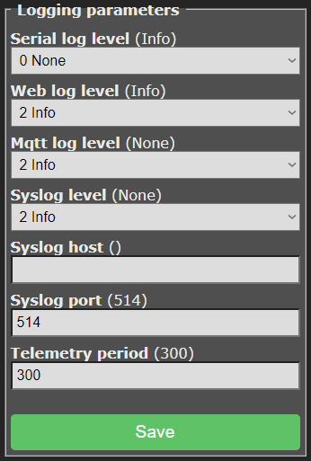
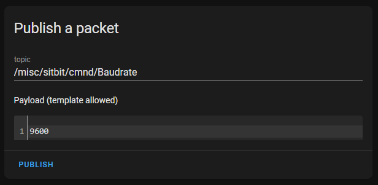
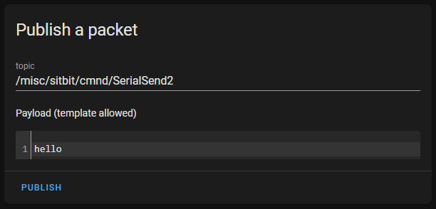
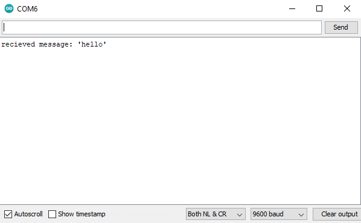

# Tasmota, Part 4: Serial Communication with Arduino

In this guide we’re going to have a look at how to send commands from a Tasmota client to an Arduino or any other serial connection.

<!-- Table of Contents -->

## Circuit

In order to test our connection we’ll use the following circuit.

|**ESP-01S**|**Arduino**|
|-----------|-----------|
|GND        |GND        |
|VCC        |3.3V       |
|RST        |RESET      |
|GPIO2      |Pin 2 (RX) |
|RX         |Pin 3 (TX) |

Note that in this configuration we are not using the hardware TX or RX pins of the Arduino. This is because using them can interfere with the native arduino logging. Instead we will use software serial pins configured on pins 2 and 3. [https://github.com/arendst/Tasmota/issues/2081](https://github.com/arendst/Tasmota/issues/2081)

The ESP-01S has hardware TX and RX pins, however using them tends to interfere with native logging processes from Tasmota. GPIO1 is used for logging messages and will always send start up logs, while GPIO0 is used for setting the ESP into flashing mode. Therefore, we will use the GPIO2 pin as a Serial TX pin and use the standard RX pin for incoming messages.

## Tasmota configuration

Tasmota allows an easy and agile way of handling MQTT messages on ES2666 chips.

> For details on setting up Tasmota or Tasmota MQTT, refer to the following:
>
> * [Tasmota: Setup and Initial Configuration.](8290305.html)
> * [Tasmota: Configuring MQTT Integration](10846209.html)

For the purposes of this article, I will be publishing to a topic `/misc/sitbit` which is listened to by an ESP-01S chip. I will publish messages to the MQTT broker via home assistant. In order to publish serial messages from Tasmota, we need to do a couple of things.

### Configure Tasmota module parameters

Since we will be using the GPIO2 and GPIO3 (RX) pins on the ESP-01S for forwarding and receiving MQTT messages, we need to configure those pin functions in the Tasmota configuration. Navigate to **Configuration** → **Configure Module** and set:

* **GPIO2**: Serial TX
* **GPIO3**: Serial RX


For details on the various ESP board pinouts, have a look at this: [https://randomnerdtutorials.com/esp8266-pinout-reference-gpios/](https://randomnerdtutorials.com/esp8266-pinout-reference-gpios/)

### Configure Tasmota logging

Tasmota by default will send logs via it’s serial pins. To disable this, set the log levels via **Configuration** → **Configure Logging** to:



### Configure Tasmota baudrate

Tasmota by default communicates on 115200, however, Arduino typically uses 9600. We’ll drop the baudrate on Tasmota to match Arduino.

We can configure the Tasmota baudrate using using MQTT tasmota commands from the Serial Send group.

> For more commands available on the Tasmota API, refer to the following: [https://tasmota.github.io/docs/Commands/](https://tasmota.github.io/docs/Commands/)

The command to set the baud rate to 9600 on Tasmota is as follows:

```bash
%topic%/cmnd/Baudrate
/misc/sitbit/cmnd/Baudrate
```



**Tasmota logs:**

```log
20:38:53.174 SER: Set to 8N1 9600 bit/s
20:38:53.179 MQT: /misc/sitbit/stat/RESULT = {"Baudrate":9600}
```

## Arduino script

In this script we configure a software serial pinout on Arduino pins 2 and 3. We also set the communication baudrate to 9600 as this is the default Arduino comms rate.

> The script used for this integration is based on the following:
>
> * [https://docs.arduino.cc/tutorials/communication/SoftwareSerialExample](https://docs.arduino.cc/tutorials/communication/SoftwareSerialExample)

The code itself listens to when a message has been received on pin 3 and:

* Publishes the message to the Arduino serial monitor.
* Responds with a message back to the ESP chip on pin 2.

```c
#include <SoftwareSerial.h>

const int rx = 2;
const int tx = 3;

SoftwareSerial mySerial(rx, tx);

void setup() {
  pinMode(rx, INPUT);
  pinMode(tx, OUTPUT);
  
  Serial.begin(9600);
  while (!Serial) {
    ; // wait for serial port to connect
  }

  // set the data rate for the SoftwareSerial port
  mySerial.begin(9600);
}

void loop() // run over and over
{
  if (mySerial.available()) {
    String message = mySerial.readString();
    Serial.print("recieved message: '" + message + "'");
    mySerial.print("recieved message: '" + message + "'");
    delay(100);
  }
}
```

### Testing

In order to publish a message with the intent of passing that message on via configured serial pins, we will use the Tasmota command `SerialSend`. [https://github.com/arendst/Tasmota/issues/2182](https://github.com/arendst/Tasmota/issues/2182)

The SerialSend command has different versions with different configurations. We will use `SerialSend2` which does not append new lines to the end of the transmitted message.

```bash
/misc/sitbit/cmnd/SerialSend2
```



**Arduino serial monitor logs**:



**Tasmota logs:**

```log
06:08:59.853 MQT: /misc/sitbit/stat/RESULT = {"SerialSend":"Done"}
06:09:01.036 MQT: /misc/sitbit/tele/RESULT = {"SerialReceived":"recieved message: 'hello'"}
```

## Conclusion

In this article, we’ve covered how to configure serial communication between Tasmota and Arduino.

## References

1. [https://randomnerdtutorials.com/esp8266-pinout-reference-gpios/](https://randomnerdtutorials.com/esp8266-pinout-reference-gpios/)
2. [https://github.com/arendst/Tasmota/issues/2081](https://github.com/arendst/Tasmota/issues/2081)
3. [https://docs.arduino.cc/tutorials/communication/SoftwareSerialExample](https://docs.arduino.cc/tutorials/communication/SoftwareSerialExample)
4. [https://github.com/arendst/Tasmota/issues/2182](https://github.com/arendst/Tasmota/issues/2182)
5. [https://tasmota.github.io/docs/Commands/](https://tasmota.github.io/docs/Commands/)

**Other:**

1. [https://github.com/arendst/Tasmota/discussions/11493](https://github.com/arendst/Tasmota/discussions/11493)
