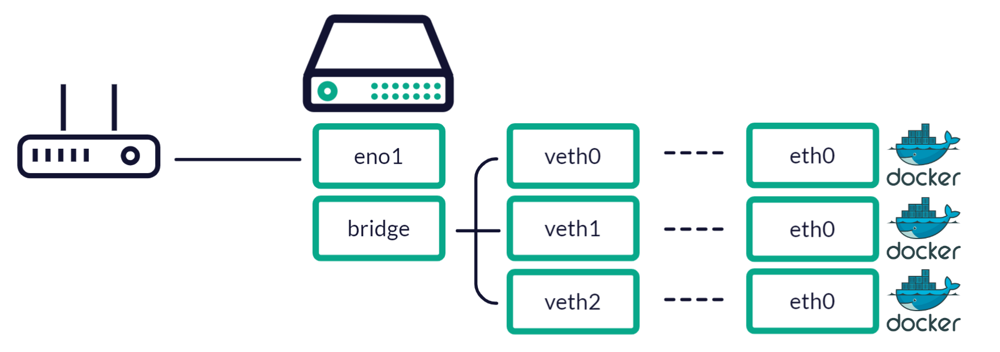

# Home Server, Part 4: Docker Networks

At the moment, I’ve sort of thrown together my home server. I’ve found I’ve got a fairly standardised knowledge of Docker, containers and networking. But this wouldn’t be fun if I didn’t learn anything while setting up all these toys.

It also turns out that Docker networks are extremely cool.



## Docker Networks

Docker has seven different network types and they’re as follows:

1. Default bridge.
2. User-defined bridge.
3. MACVLAN
4. IPVLAN (L2)
5. IPVLAN (L3)
6. Overlay
7. None

By default, a fresh Docker installation will be created with a default bridge, host network (MACVLAN) and a none network.

Using Docker Compose, the network setup will behave a little differently. In a Docker Compose setup, the directory that the docker-compose.yml is created in will create a network based on the name of that directory.

## Network 1: The default bridge

I’ve already done some toying with my Docker instance. So at the moment, I’ve already established an additional network on my Docker host.

```bash
sudo docker network ls
```

```bash
NETWORK ID     NAME          DRIVER    SCOPE
f4aa7ea18b56   bridge        bridge    local
b37f41df4666   host          host      local
de0434d61f14   none          null      local
3201469f0a8b   opt_default   bridge    local
```

As you can see, besides the three default networks that ship with Docker (bridge, host, none), I’ve already created a new user-defined bridge network (coming later) called **opt\_default**.

Network Driver here is equivalent to network type. There are seven!

### Default Container Networks

But what about containers? How do they fit into the mix? Let’s take a look at the current state of our docker host network.

```bash
ip add show
```

**Defaults:**

```bash
1: lo: <LOOPBACK,UP,LOWER_UP> mtu 65536 qdisc noqueue state UNKNOWN group default qlen 1000
    link/loopback 00:00:00:00:00:00 brd 00:00:00:00:00:00
    inet 127.0.0.1/8 scope host lo
       valid_lft forever preferred_lft forever
    inet6 ::1/128 scope host 
       valid_lft forever preferred_lft forever
2: eno1: <BROADCAST,MULTICAST,UP,LOWER_UP> mtu 1500 qdisc fq_codel state UP group default qlen 1000
    link/ether 1c:69:7a:aa:53:72 brd ff:ff:ff:ff:ff:ff
    inet 192.168.0.10/24 brd 192.168.0.255 scope global eno1
       valid_lft forever preferred_lft forever
    inet6 fd01::1e69:7aff:feaa:5372/64 scope global dynamic mngtmpaddr noprefixroute 
       valid_lft 256sec preferred_lft 256sec
    inet6 fe80::1e69:7aff:feaa:5372/64 scope link 
       valid_lft forever preferred_lft forever
3: wlo2: <BROADCAST,MULTICAST> mtu 1500 qdisc noop state DOWN group default qlen 1000
    link/ether 14:85:7f:84:de:1f brd ff:ff:ff:ff:ff:ff
```

**Docker:**

```bash
4: br-3201469f0a8b: <BROADCAST,MULTICAST,UP,LOWER_UP> mtu 1500 qdisc noqueue state UP group default 
    link/ether 02:42:14:84:d9:08 brd ff:ff:ff:ff:ff:ff
    inet 172.18.0.1/16 brd 172.18.255.255 scope global br-3201469f0a8b
       valid_lft forever preferred_lft forever
    inet6 fe80::42:14ff:fe84:d908/64 scope link 
       valid_lft forever preferred_lft forever
5: docker0: <NO-CARRIER,BROADCAST,MULTICAST,UP> mtu 1500 qdisc noqueue state DOWN group default 
    link/ether 02:42:11:37:4c:f4 brd ff:ff:ff:ff:ff:ff
    inet 172.17.0.1/16 brd 172.17.255.255 scope global docker0
       valid_lft forever preferred_lft forever
```

**Containers:**

```bash
35: vethd19a6be@if34: <BROADCAST,MULTICAST,UP,LOWER_UP> mtu 1500 qdisc noqueue master br-3201469f0a8b state UP group default 
    link/ether 66:5d:2c:a2:b2:91 brd ff:ff:ff:ff:ff:ff link-netnsid 0
    inet6 fe80::645d:2cff:fea2:b291/64 scope link 
       valid_lft forever preferred_lft forever
37: vetha60f0a8@if36: <BROADCAST,MULTICAST,UP,LOWER_UP> mtu 1500 qdisc noqueue master br-3201469f0a8b state UP group default 
    link/ether 02:d2:41:ff:9f:d9 brd ff:ff:ff:ff:ff:ff link-netnsid 13
    inet6 fe80::d2:41ff:feff:9fd9/64 scope link 
       valid_lft forever preferred_lft forever
39: veth7e8dabe@if38: <BROADCAST,MULTICAST,UP,LOWER_UP> mtu 1500 qdisc noqueue master br-3201469f0a8b state UP group default 
    link/ether 7a:87:f9:da:56:71 brd ff:ff:ff:ff:ff:ff link-netnsid 1
    inet6 fe80::7887:f9ff:feda:5671/64 scope link 
       valid_lft forever preferred_lft forever
41: veth4f400de@if40: <BROADCAST,MULTICAST,UP,LOWER_UP> mtu 1500 qdisc noqueue master br-3201469f0a8b state UP group default 
    link/ether d6:6e:2f:20:27:ed brd ff:ff:ff:ff:ff:ff link-netnsid 2
    inet6 fe80::d46e:2fff:fe20:27ed/64 scope link 
       valid_lft forever preferred_lft forever
45: vethe7f528a@if44: <BROADCAST,MULTICAST,UP,LOWER_UP> mtu 1500 qdisc noqueue master br-3201469f0a8b state UP group default 
    link/ether 1e:91:bf:9e:ba:c2 brd ff:ff:ff:ff:ff:ff link-netnsid 6
    inet6 fe80::1c91:bfff:fe9e:bac2/64 scope link 
       valid_lft forever preferred_lft forever
49: veth0ef0c37@if48: <BROADCAST,MULTICAST,UP,LOWER_UP> mtu 1500 qdisc noqueue master br-3201469f0a8b state UP group default 
    link/ether 9e:8b:eb:47:d9:55 brd ff:ff:ff:ff:ff:ff link-netnsid 12
    inet6 fe80::9c8b:ebff:fe47:d955/64 scope link 
       valid_lft forever preferred_lft forever
51: vethee41b69@if50: <BROADCAST,MULTICAST,UP,LOWER_UP> mtu 1500 qdisc noqueue master br-3201469f0a8b state UP group default 
    link/ether 5e:29:6c:95:b4:7e brd ff:ff:ff:ff:ff:ff link-netnsid 3
    inet6 fe80::5c29:6cff:fe95:b47e/64 scope link 
       valid_lft forever preferred_lft forever
53: vethb98cda4@if52: <BROADCAST,MULTICAST,UP,LOWER_UP> mtu 1500 qdisc noqueue master br-3201469f0a8b state UP group default 
    link/ether de:fb:2d:a4:d1:f1 brd ff:ff:ff:ff:ff:ff link-netnsid 10
    inet6 fe80::dcfb:2dff:fea4:d1f1/64 scope link 
       valid_lft forever preferred_lft forever
55: veth69f35d4@if54: <BROADCAST,MULTICAST,UP,LOWER_UP> mtu 1500 qdisc noqueue master br-3201469f0a8b state UP group default 
    link/ether 7e:b8:cd:37:0d:a8 brd ff:ff:ff:ff:ff:ff link-netnsid 11
    inet6 fe80::7cb8:cdff:fe37:da8/64 scope link 
       valid_lft forever preferred_lft forever
77: veth8b7b17e@if76: <BROADCAST,MULTICAST,UP,LOWER_UP> mtu 1500 qdisc noqueue master br-3201469f0a8b state UP group default 
    link/ether 1e:bf:bf:fb:d0:d3 brd ff:ff:ff:ff:ff:ff link-netnsid 4
    inet6 fe80::1cbf:bfff:fefb:d0d3/64 scope link 
       valid_lft forever preferred_lft forever
81: vetha5a2983@if80: <BROADCAST,MULTICAST,UP,LOWER_UP> mtu 1500 qdisc noqueue master br-3201469f0a8b state UP group default 
    link/ether 0a:c1:aa:78:6d:9a brd ff:ff:ff:ff:ff:ff link-netnsid 5
    inet6 fe80::8c1:aaff:fe78:6d9a/64 scope link 
       valid_lft forever preferred_lft forever
```

That’s… a lot of connections.

For each container added, Docker will spin up a virtual ethernet connection for each of them and automatically connect them to the bridge they belong to. Running the following command will display the list of virtual ethernet interfaces (ie, container interfaces) and the bridge network they are connected to.

```bash
bridge link
```

```bash
35: vethd19a6be@if34: <BROADCAST,MULTICAST,UP,LOWER_UP> mtu 1500 master br-3201469f0a8b state forwarding priority 32 cost 2 
37: vetha60f0a8@if36: <BROADCAST,MULTICAST,UP,LOWER_UP> mtu 1500 master br-3201469f0a8b state forwarding priority 32 cost 2 
39: veth7e8dabe@if38: <BROADCAST,MULTICAST,UP,LOWER_UP> mtu 1500 master br-3201469f0a8b state forwarding priority 32 cost 2 
41: veth4f400de@if40: <BROADCAST,MULTICAST,UP,LOWER_UP> mtu 1500 master br-3201469f0a8b state forwarding priority 32 cost 2 
45: vethe7f528a@if44: <BROADCAST,MULTICAST,UP,LOWER_UP> mtu 1500 master br-3201469f0a8b state forwarding priority 32 cost 2 
49: veth0ef0c37@if48: <BROADCAST,MULTICAST,UP,LOWER_UP> mtu 1500 master br-3201469f0a8b state forwarding priority 32 cost 2 
51: vethee41b69@if50: <BROADCAST,MULTICAST,UP,LOWER_UP> mtu 1500 master br-3201469f0a8b state forwarding priority 32 cost 2 
53: vethb98cda4@if52: <BROADCAST,MULTICAST,UP,LOWER_UP> mtu 1500 master br-3201469f0a8b state forwarding priority 32 cost 2 
55: veth69f35d4@if54: <BROADCAST,MULTICAST,UP,LOWER_UP> mtu 1500 master br-3201469f0a8b state forwarding priority 32 cost 2 
77: veth8b7b17e@if76: <BROADCAST,MULTICAST,UP,LOWER_UP> mtu 1500 master br-3201469f0a8b state forwarding priority 32 cost 2 
81: vetha5a2983@if80: <BROADCAST,MULTICAST,UP,LOWER_UP> mtu 1500 master br-3201469f0a8b state forwarding priority 32 cost 2 
```

Typically, the default bridge that Docker will connect these virtual ethernet connections to will be docker0. However, looks like I’ve overridden my default network bridge with the opt\_docker bridge which has all my containers connected to it.

### An obligatory infographic

Our Docker host has been configured with a bridge network. For each container added to the host, Docker creates a virtual ethernet interface and connects it to a bridge network. The virtual ethernet interface is then mapped to the eth0 port of each of the docker containers.



### Docker network DHCP and DNS

Now, not only did the Docker bridge set up virtual ethernet interfaces, but it also created IP addresses for each of the containers. Which means our bridge is also hosting DHCP and DNS functionality.

Let’s take a look at the bridge that’s in use most in my setup, opt\_default:

```bash
docker inspect opt_default
```

```json
[
    {
        "Name": "opt_default",
        "Id": "3201469f0a8b9e82634d2d8255864988d59d011def8280711f7224d9e494a30d",
        "Created": "2022-05-17T07:30:17.828131539Z",
        "Scope": "local",
        "Driver": "bridge",
        "EnableIPv6": false,
        "IPAM": {
            "Driver": "default",
            "Options": null,
            "Config": [
                {
                    "Subnet": "172.18.0.0/16",
                    "Gateway": "172.18.0.1"
                }
            ]
        },
        "Internal": false,
        "Attachable": true,
        "Ingress": false,
        "ConfigFrom": {
            "Network": ""
        },
        "ConfigOnly": false,
        "Containers": {
            "08b9979bb3095f2396303b79fb07e1f8e3cb69fa513e3ca5a44c4ce028be129b": {
                "Name": "mosquitto",
                "EndpointID": "43e3d38d74792996985a9a13db4002b1513539d0786ca9b44b8442085517fa88",
                "MacAddress": "02:42:ac:12:00:08",
                "IPv4Address": "172.18.0.8/16",
                "IPv6Address": ""
            },
            "0dee2e952d33176d7c6915797192f0849117baedad8bac3052b63418e7438167": {
                "Name": "komga",
                "EndpointID": "aaa82ad2454131f2810cbd10513727b9d452475af6f960e921d21f2c10c4b407",
                "MacAddress": "02:42:ac:12:00:0b",
                "IPv4Address": "172.18.0.11/16",
                "IPv6Address": ""
            },
            "34c65afa136f40b3eb20ae30ca4f234ab7018cdd297dac4ee5ea99a05bf10a24": {
                "Name": "radarr",
                "EndpointID": "8680225d6df02b347658c9fdac16dc5aa690919bbf1d275afac26e944fa0b36c",
                "MacAddress": "02:42:ac:12:00:04",
                "IPv4Address": "172.18.0.4/16",
                "IPv6Address": ""
            },
            "3ecb57003f0c2f5206f9f9d303b47bfa3eacdd3a4b80cc12f0507b9273ff28b4": {
                "Name": "portainer",
                "EndpointID": "fae29931be0cda98370e8a433e679a14b1b0a5a45d600fe230e7a2cf039ad094",
                "MacAddress": "02:42:ac:12:00:05",
                "IPv4Address": "172.18.0.5/16",
                "IPv6Address": ""
            },
            "4728bd569d671ece2f2a4efada7a92892216b5b8adb58428ea29aeea11f4a61c": {
                "Name": "sonarr",
                "EndpointID": "8aa9c58afb8298a5e33e8de7140fd7120f68bd1734461c404de8fba24448e4c0",
                "MacAddress": "02:42:ac:12:00:07",
                "IPv4Address": "172.18.0.7/16",
                "IPv6Address": ""
            },
            "62ba2a9ed3505463d8d31e121aa4f9f7f4a3ee29f24676245e40642e2c7bed15": {
                "Name": "duplicati",
                "EndpointID": "c90ae2e3c357272ac39d53055c3d848e920c09dfc6c46443693c04010b8335fa",
                "MacAddress": "02:42:ac:12:00:0a",
                "IPv4Address": "172.18.0.10/16",
                "IPv6Address": ""
            },
            "a438d9fec7c0cc3b2357c96eb3d02693fb525c3d15baa989a65d54c132e56d7b": {
                "Name": "deluge",
                "EndpointID": "618f0d4a1403d97274256ff44565be3d51dfb55d55fc5213360b88a79d2006c7",
                "MacAddress": "02:42:ac:12:00:03",
                "IPv4Address": "172.18.0.3/16",
                "IPv6Address": ""
            },
            "a67817bd09f75248318114d41f47e374f68c8e8fe5793b95676ecff4902a9a90": {
                "Name": "jackett",
                "EndpointID": "08ea48706e18be4f015dbf6bbc46c399de5df030bab9e37a49515cd93104d1f7",
                "MacAddress": "02:42:ac:12:00:09",
                "IPv4Address": "172.18.0.9/16",
                "IPv6Address": ""
            },
            "dec7d4e29970c888d75ab0753f35c11c725988e12fa2fcfaea3c1a9907930beb": {
                "Name": "nginx",
                "EndpointID": "796070a4b2aff6f4a8731e84235a973a6b8230f612f4bdfe5e0d5b836ee03fc5",
                "MacAddress": "02:42:ac:12:00:06",
                "IPv4Address": "172.18.0.6/16",
                "IPv6Address": ""
            },
            "ded46e3f9aa270510bc8a70fa8297fdfec5bc36fd2cec97a29ce6dc6cfe786c4": {
                "Name": "podgrab",
                "EndpointID": "77021bda9e8d1f319b9c90738f800d2d1e1ce373307932e7e35a4fe94086b820",
                "MacAddress": "02:42:ac:12:00:0c",
                "IPv4Address": "172.18.0.12/16",
                "IPv6Address": ""
            },
            "f12ba2c0c05656b5027840e554a1cb52c67c7bd24b15ed1d8d313c5e7eec3ba5": {
                "Name": "smokeping",
                "EndpointID": "86def6ebc41e601fea7d23d7ab57ef072b90c7424bff3875a21a30a0ce9e174c",
                "MacAddress": "02:42:ac:12:00:02",
                "IPv4Address": "172.18.0.2/16",
                "IPv6Address": ""
            }
        },
        "Options": {},
        "Labels": {
            "com.docker.compose.network": "default",
            "com.docker.compose.project": "opt",
            "com.docker.compose.version": "1.29.2"
        }
    }
]
```

Take a look at the values it comes back with. We can see that the network subnet is `172.18.0.0` and that each container has been assigned an IP address on this subnet.

This network also has DNS so that it can communicate with all containers and all containers can communicate with one another. Docker actually makes a copy of the /etc/resolve.conf file and places it onto each container. This is to ensure they are all aware of the same hosts.

We can test this out. Let’s jump into the shell of one of the available Docker containers, and try and ping another container.

```bash
docker exec -it podgrab sh
```

We’ve now logged into the podgrab container. As you can see, this container only has it’s eth0 network interface exposed which is the connection currently hosted by a virtual ethernet interface on the network bridge.

```bash
/api # ip add
1: lo: <LOOPBACK,UP,LOWER_UP> mtu 65536 qdisc noqueue state UNKNOWN qlen 1000
    link/loopback 00:00:00:00:00:00 brd 00:00:00:00:00:00
    inet 127.0.0.1/8 scope host lo
       valid_lft forever preferred_lft forever
54: eth0@if55: <BROADCAST,MULTICAST,UP,LOWER_UP,M-DOWN> mtu 1500 qdisc noqueue state UP 
    link/ether 02:42:ac:12:00:0c brd ff:ff:ff:ff:ff:ff
    inet 172.18.0.12/16 brd 172.18.255.255 scope global eth0
       valid_lft forever preferred_lft forever
```

From the podgrab container, we can freely ping the deluge container:

```bash
/api # ping 172.18.0.3
PING 172.18.0.3 (172.18.0.3): 56 data bytes
64 bytes from 172.18.0.3: seq=0 ttl=64 time=0.246 ms
64 bytes from 172.18.0.3: seq=1 ttl=64 time=0.251 ms
64 bytes from 172.18.0.3: seq=2 ttl=64 time=0.254 ms
64 bytes from 172.18.0.3: seq=3 ttl=64 time=0.252 ms
64 bytes from 172.18.0.3: seq=4 ttl=64 time=0.245 ms
^C
--- 172.18.0.3 ping statistics ---
5 packets transmitted, 5 packets received, 0% packet loss
round-trip min/avg/max = 0.245/0.249/0.254 ms 
```

## Network 2: User-defined bridge

## Conclusion

asdf

## References

1. [https://docs.docker.com/compose/networking/](https://docs.docker.com/compose/networking/)
