# Home Server, Part 5: Remote Access

I have a general requirement to access my home server from outside my network. This comes with a fair share of panic and stress over how to set things up properly. It would put a slight damper on things if the hackers got in and commandeered the toaster to subject myself and other friendlies to buttered sabotage.

Initially I had exposed a few of the home services with a duckdns domain name and nginx. I’ve since changed my mind about valuing free domains over peace of mind and have opted to buy my own domain and monitor things through CloudFlare. I’ll still be using nginx, but thought that this time I’d document things a little better for future me to look back on fondly to identify where I messed up and sacrificed the privacy of my toaster.



## Choosing a domain name

> Props to Richard Watson for an awesome read on the subject: [https://richardwatson.co/choosing-a-domain-name.html](https://richardwatson.co/choosing-a-domain-name.html)

I’ll put down my requirements for it as follows:

* Cheap
* Mildly entertaining

There’s not much to say on either point except that I’d probably be fairly happy with [badgerr.duckdns.org](http://badgerr.duckdns.org) if I didn’t think it was a bit alarming that google seemed to think I was hosting a phishing site and if I hadn’t been sold on the wonders of CloudFlare after a few reads and chats with those who surely know better than I do.

In the end I found my domain in [badger-quest.com](http://badger-quest.com). Not only was it available, but comes with a .com attached, makes me giggle and is under $9.00 a year. Mission accomplished.

## An obligatory infographic

My setup will be as follows. Any requests to [badger-quest.com](http://badger-quest.com) from the interwebs will all be routed through CloudFlare, which will give us a few great (and free) additional features. CloudFlare will be the only external entity which will hit my router public IP. All communication should hit the secure 443 port and use SSL.

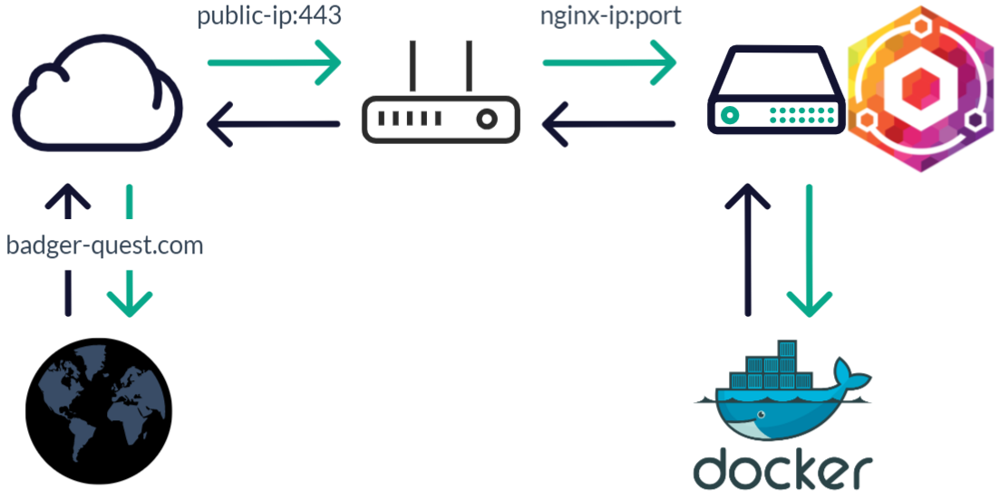

On my local network, the router’s public IP will route traffic through to an nginx container hosted on my home server. We’ll need to set up a passthrough rule on my router to route traffic from the router public IP and port 443 to the nginx server IP and port. Nginx will route traffic to the particular docker container associated with the prefix of the [badger-quest.com](http://badger-quest.com) domain (eg, [assistant.badger-quest.com](http://assistant.badger-quest.com) will route to the home assistant docker container).

## Registering the domain

There are plenty of domain purchasing platforms to pick from, but I went with CloudFlare. Mostly because I intended to register the domain through CloudFlare and take advantage of some of their free features anyway and because there’s no markup involved in their domain registrar.

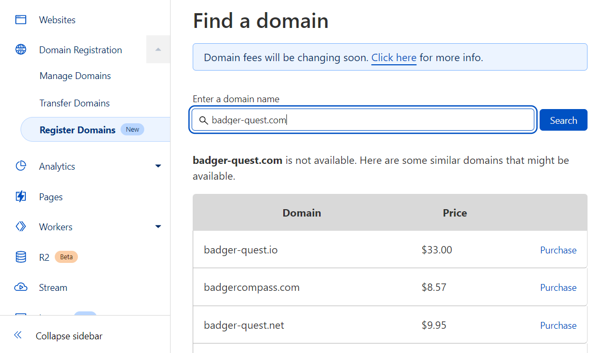

1. Create an account, login and head over to the “Register Domains tab.
2. Enter in your [awesomedomain.com](http://awesomedomain.com) and find the compromise you’re happy with.
3. Once you’ve purchased it, you should see it as a listed website for your account, otherwise add it.

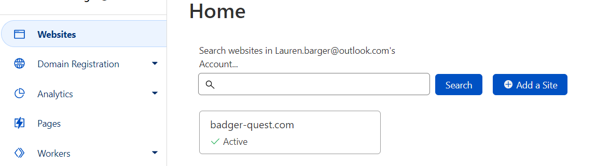

## Nginx Proxy Manager Docker setup

Let’s configure nginx proxy manager. I’ll be setting up npm on a docker container on my home server.

[https://nginxproxymanager.com/](https://nginxproxymanager.com/) is a docker hosted reverse proxy manager made simpler with a clean and intuitive interface.

1. First we’ll create a docker-compose entry for nginx proxy manager. All instructions to do so can be found in the [nginx proxy manger documentation](https://nginxproxymanager.com/setup/#running-the-app). There are two options available, to either have use the local DB instance for the nginx container or host your own one. My configuration is as follows:  

    ```yaml
    version: '3.0'

    services:
      nginx:
        image: jc21/nginx-proxy-manager:latest
        container_name: nginx
        depends_on:
          - plex
          - homeassistant
        ports:
          - 80:80
          - 81:81
          - 443:443
        restart: unless-stopped
        volumes:
          - /opt/nginx/config:/config
          - /opt/nginx/data:/data
          - /opt/nginx/letsencrypt:/etc/letsencrypt
    ```

2. Navigate to your server IP and the port that you mapped the nginx proxy manager port 81 to. In my case, [http://172.0.0.1:81](http://172.0.0.1:81). Login with the default email and password:  

    > email: admin@example.com
    >
    > password: changeme

    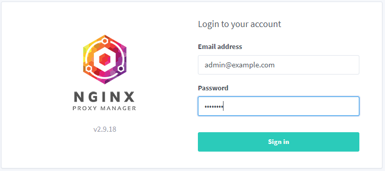
3. After logging in, you’ll be prompted to create your correct user which you’ll use for logging in from now on.

## Router port opening

Now that we’ve configured nginx proxy manager, we need to expose nginx container through our router. This step will be very different for the specific router. At the moment I have a D-Link DIR-825 and my configuration is as follows:

1. Login to your router administration page, and find your port forwarding settings.
2. We need to configure 2 rules, one for http connections and another for https:

|**Name**           |**Protocol** |**Public Port**            |**Private Port**                       |**Public Port  |
|-------------------|-------------|---------------------------|---------------------------------------|---------------|
|badger-quest-http  |TCP          |nginx container IP address |nginx port mapped to container port 80 |80             |
|badger-quest-https |TCP          |nginx container IP address |nginx port mapped to container port 443|443            |

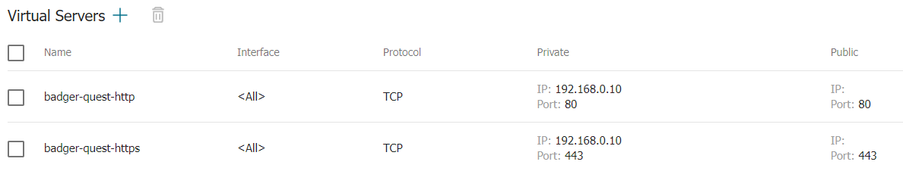

What this does is redirect any traffic that the router receives on it’s public IP to the private IP and port of nginx proxy manager.

> **Update:**
>
>I’ve since switched service providers and therefore routers to a [MikroTik hAP ac2](https://www.google.com/url?url=https://www.takealot.com/mikrotik-hap-ac2/PLID54756548&rct=j&q=&esrc=s&sa=U&ved=0ahUKEwiCvdyD3o76AhWwSUEAHTGdDKEQ2SkIggo&usg=AOvVaw2JEaqOO70_4822TeTBaegp), and the port forwarding settings are a little different:

<!-- Fill in mikrotik info -->

## CloudFlare configuration

Our router is now redirecting all traffic it receives on it’s public IP on ports 80 and 443 to the nginx proxy manager container on the corresponding ports. Our next step is to configure CloudFlare to direct all traffic received at [badger-quest.com](http://badger-quest.com) to our router’s public IP.

### CloudFlare Domain API Token

CloudFlare is going to be responsible for creating an SSL cert for our domain. In order to do this, we will need an API token.

1. Login to your CloudFlare account, go to your profile page and select the API Tokens option on the side menu.
2. Select the **Create Token** option.
3. Select the **Edit zone DNS** API template option.
    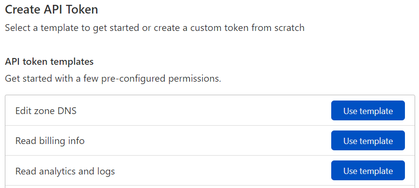
4. All options here can be kept at default except the **Zone Resources** option which we need to change to **All zones**.
    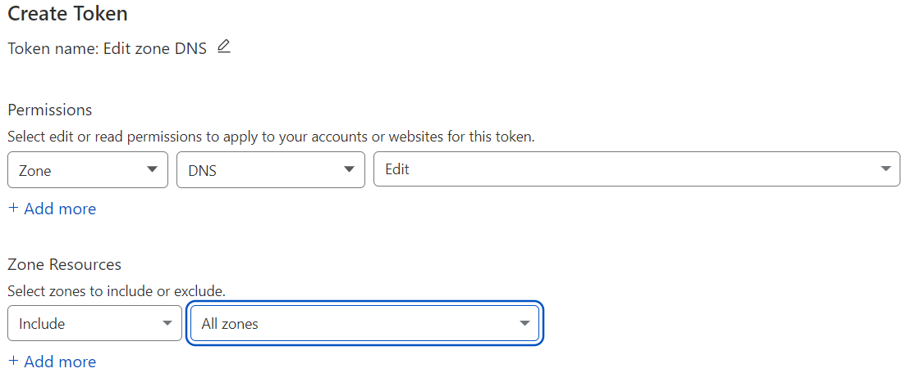
5. Hit **Continue to Summary** and create your token.

Note, your token will not be accessible after leaving the **API Tokens** view. Make sure you save it in a safe place.

Once your token is created you can check to see if it’s been set up correctly by executing the curl command that will be displayed in the API Tokens view in a CMD window. The response should look something like this:

```json
{"result":{"id":"099ca3bb393e678a7ba10aa785d66fb0","status":"active"},"success":true,"errors":[],"messages":[{"code":10000,"message":"This API Token is valid and active","type":null}]}
```

### Domain DNS Record

<!-- Update this -->

Head back to your website entry and go to the DNS option on the side panel. It’s here that we will configure how our subdomain points to our server IP.

For testing purposes, we will setup a subdomain for reading comics. I’ll expose an endpoint pointing to my [https://komga.org/](https://komga.org/) Docker container. Ideally, we will need to expose the home assistant container however, this requires additional setup which I’ll include in a separate article.

In order to setup our subdomain, we need to create an A record in our DNS settings for our domain.

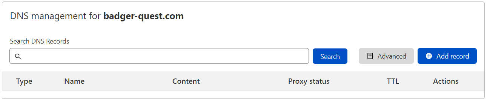

Select Add record and enter in the subdomain you’d like to point to your Docker container and the public IP of your router.

You can find the public IP of your router by going to [What Is My IP](https://www.whatismyip.com/) or googling “what is my ip”.

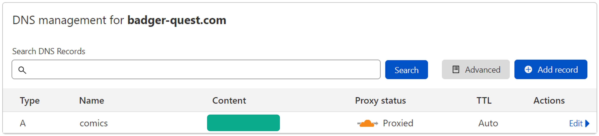

### SSL configuration

Select the **SSL/TLS** tab on the left panel of CloudFlare. In the Overview screen change your SSL/TLS mode to **Full (strict)**. This will ensure that your traffic is encrypted end to end on the CloudFlare server.

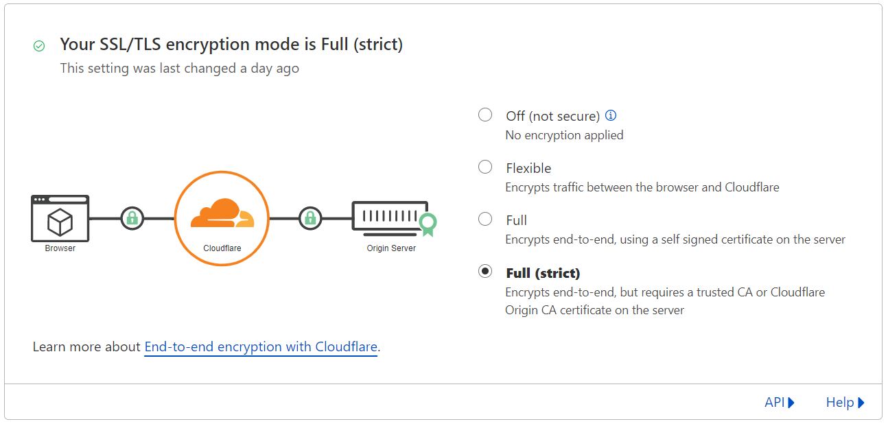

Once done select the **Edge Certificates** option on the left panel and make sure **Always Use HTTPS** is enabled.

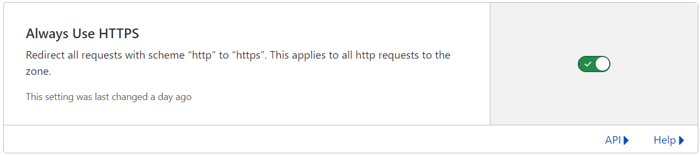

## Nginx Proxy Manager hosts

At this point we have everything configured to direct traffic from [comics.badger-quest.com](http://comics.badger-quest.com) to our router which is redirecting the traffic to our nginx proxy manager container. We still need to configure nginx proxy manager to direct traffic for a given subdomain to the correct docker container. We also still need to configure SSL.

### Nginx SSL configuration

Open up your nginx proxy manager configuration page (your-server-ip:81), login and open up the **SSL Certificates** tab. Select **Add SSL Certificate**.

One option is to configure a different certificate for each subdomain you have (eg, a cert for [comics.badger-quest.com](http://comics.badger-quest.com), [assistant.badger-quest.com](http://assistant.badger-quest.com), etc.), however it’s simpler and cleaner to rather create a certificate with a wildcard so that we can use the same cert for every subdomain on [badger-quest.com](http://badger-quest.com).

I’ll enter the domain name as \*.badger-quest.com, my email and enable the **Use a DNS Challenge** option. Our DNS provider is CloudFlare. The credentials file content will auto-populate a placeholder API token. Replace the token with the API token we generated in CloudFlare.

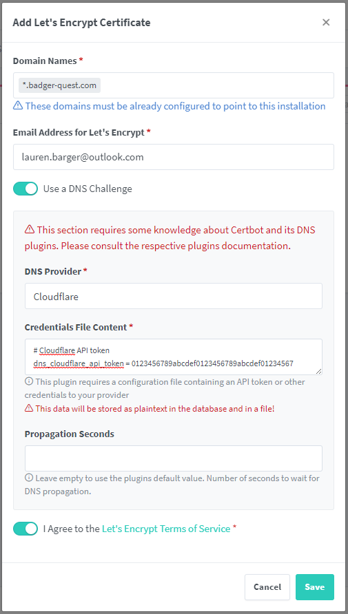

Agree to the terms of service and save. Your certificate will generate and appear in the SSL Certificates window.

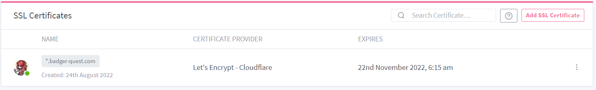

### Nginx proxy hosts

Our final step is to configure our nginx proxy manager sources. What this does is map an incoming subdomain to a given container on our private server.

Select the **Hosts** tab on nginx proxy manager, go to **Proxy Hosts** and select **Add Proxy Host**.

The **Domain Names** will be the A record that you set up on CloudFlare. We’ll be pointing that subdomain to the Komga instance on my private server. Add the private server IP and the port where the container is hosted.

Whether or not the scheme should be http or https will depend on the container that you’re pointing to. Komga is set to use http, so we will set the record to http. Finally, it’s typically recommended to enable the **Block Common Exploits** option.

Setting up an nginx host with an http connection is typically fine. The traffic between nginx proxy manager and the container will not be encrypted, however all traffic between nginx proxy manager and Cloudflare, and therefore any external connections, will be encrypted

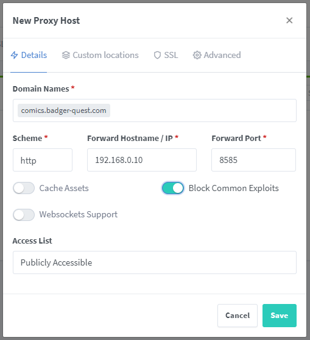

Head over to the **SSL tab** on the New Proxy Host menu. Select the wildcard certificate that we created earlier, and set **Force SSL**.

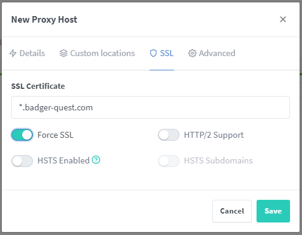

Hit **Save** and the entry should appear in your **Proxy Hosts** screen.

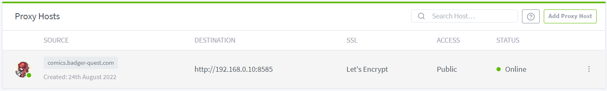

## Testing

If all is well, we should have exposed our comic endpoint to the universe! Let’s test.

Open up [https://comics.badger-quest.com](https://comics.badger-quest.com) and check to make sure everything is accessed correctly. If all goes well, you should be able to access your site as you typically would through the local IP address.

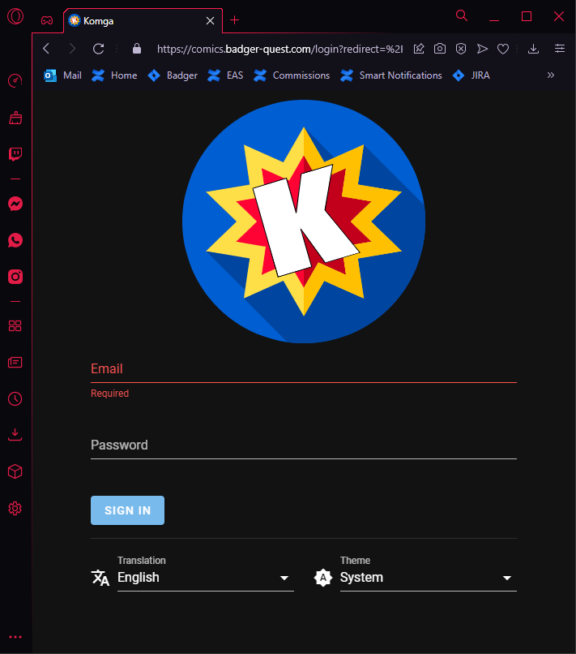

> Note! You may need to open up the port on your local server firewall rules. For example, I needed to open up port 8585 on my home server in order to access it through the domain:
>
> ```bash
> sudo ufw allow 8585
> ```

## Conclusion

At this point your home server is securely exposed to the greater web. Next steps include exposing home assistant over the same connection which includes a few additional steps in the home assistant configurations.

## References

1. [https://www.youtube.com/watch?v=GarMdDTAZJo](https://www.youtube.com/watch?v=GarMdDTAZJo)
