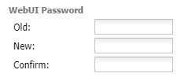

# Media Server, Part 2: Deluge

The first piece of the media server that we will configure is a torrent client. For this build, I’ll be using Deluge. There are many torrent client options available and each have their pros and cons, but we’re using Deluge for this build. Deluge is also going to allow us to set things like active downloading hours and download options specific to the source of the downloading request.

This section assumes the following has been completed:

[Home Server, Part 1: Hardware](2031617.html)

[Home Server, Part 2: Ubuntu OS](14024705.html)

[Home Server, Part 3: Docker](1900552.html)

<!-- Table of Contents -->

Deluge Docker container.
========================

Add the following container details to your docker-compose.yaml [https://hub.docker.com/r/linuxserver/deluge](https://hub.docker.com/r/linuxserver/deluge):

```yaml
  deluge:
    image: lscr.io/linuxserver/deluge:latest
    container_name: deluge
    environment:
      - PUID=1000
      - PGID=1000
      - TZ=Africa/Johannesburg
      - DELUGE_LOGLEVEL=error #optional
    volumes:
      - /opt/deluge/config:/config
      - /mnt/media/downloads:/downloads
    ports:
      - 8112:8112
      - 6881:6881
      - 6881:6881/udp
    restart: unless-stopped
```

Then run the following to bring up the container:

```bash
docker-compose up -d
```

Notice how we have mounted our external hard drive media mount against the downloads directory of deluge.

In this docker compose entry we have specified a volume for the container called downloads. This folder will store all our deluge torrents and downloads while they’re seeding. For this setup, I have created a directory on an external hdd called media which will store all my media and a sub folder to handle downloads.

### Deluge folder structure

I have am using the following folder structure for my media server setup:


The way that this will work is as follows:

1. Sonarr/Radarr/Otharr will send Deluge a tag/label regarding who made the request.
2. Any new torrents will be added to the folder `/mnt/media/torrents`
3. Deluge will pick up any new torrents from the folder and start downloading into the folder `/mnt/media/downloads/incomplete`.
4. When the download finishes, it will be moved to the completed downloads folder /mnt/media/downloads/complete and, if it was requested with a tag/label it will be placed in a sub folder with the same name as the label.
5. Once this is complete, the requesting app will move the completed download out of the directory with the same label as it and move it into it’s corresponding media folder, now available for viewing.

**For example:**

1. A new episode of Bleach releases.
2. Sonarr’s RSS feed alerts it of the new release and Sonarr retrieves a torrent link via Jackett (coming soon).
3. Sonarr will place the bleach torrent into the `/mnt/media/torrents` folder
4. Deluge will pick up the torrent and start downloading the files into the `/mnt/media/downloads/incomplete` folder
5. When the download is completed, Deluge will place the file into the `/mnt/media/downloads/complete/sonarr` folder
6. Sonarr will pick the file up out of the sonarr folder and move it into the Bleach folder in `/mnt/media/anime`.

## Configuring Deluge

Navigate to the web interface for Deluge at port 8112: [http://192.168.0.10:8112](http://192.168.0.10:8112).

You will be asked to enter a username and password. The default settings are:

* user: admin
* password: deluge

### Configure download settings

Here we point Deluge to our desired incomplete and complete download folders mentioned above. Navigate to **Preferences** → **Downloads**.

Remember, we mounted the directory `/mnt/media/downloads` to the `/downloads` directory of the Deluge container. Therefore we do not need to specify the `/mnt/media` prefix when configuring directories in Deluge.

* Download to: `/downloads/incomplete`
* Move completed to: `/downloads/complete`


### Configure new password

Navigate to **Preferences** → **Interface** → **Password** and change the password so that it is not the default.



### Enable remote connections

Navigate to **Preferences** → **Daemon** and note the daemon port. Ensure that **Allow Remote Connections** is enabled.


### Configure Deluge plugins

Deluge allows the integration of several plugins which will allow us to manage our downloads with far more fine tuned control.


### Enable the required plugins

Navigate to **Preferences** → **Plugins** and enable the following:

* **Extractor**: Will make sure that files are extracted out of any kind of zip or tar format before being moved to their completed folder.
* **Label**: Will give us fine control over how we handle downloads from different sources. (When Sonarr sends a download request, Deluge will label the download as “sonarr”)
* **Scheduler**: Will allow us to schedule allowed downloading and seeding hours throughout a week.

Select **Apply** to enable the plugins.

### Extractor configuration

Navigate to **Preferences** → **Extractor** to configure the download location of the extracted torrents. In our case, the **Extract to** destination is `/downloads/complete`.


### Scheduler configuration

Navigate to **Preferences** → **Scheduler** to set your download schedule on an hourly basis throughout a week. In my case, I’ve set downloading hours to any day between 10pm and 07am.

### Label configuration

To configure the Label plugin, we need to navigate to the **Labels** section in the **Filters** menu on the left hand side of the Deluge UI:


Here you can add a label for each of the download requestors you may have on your system. You can add a label by right clicking the **Labels** heading here and selecting **Add Label**.

Once the label has been created, you can configure it’s download settings by right clicking on the created label and selecting **Label Options**.

Here you can apply individual download settings for a particular download client. Most importantly, this is where we can configure where we can configure the destination folder of the completed download. Select the **Folders** tab and enable **Apply** folder settings. Then enable **Move** completed **to** and enter the chosen destination folder.


## Testing Deluge downloads

If you’d like a quick test to see if Deluge is configured correctly, select the + button in the top left and throw in a magnet link. The torrent should then start downloading.

## Conclusion

And just like that, Deluge has been configured. It is now ready to start receiving torrent requests. Our next step is to configure our torrent index proxy service, Jackett.

## References

1. [https://deluge-torrent.org](https://deluge-torrent.org)
2. [https://hub.docker.com/r/linuxserver/deluge](https://hub.docker.com/r/linuxserver/deluge)
3. [https://zacholland.net/a-complete-guide-to-setting-up-a-plex-home-media-server-with-automated-requests-downloads/](https://zacholland.net/a-complete-guide-to-setting-up-a-plex-home-media-server-with-automated-requests-downloads/)
