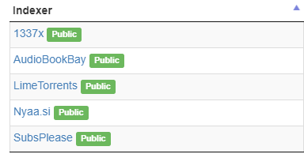

# Media Server, Part 3: Jackett

The next connected segment of our media server is Jackett. Jackett will serve to translate requests from our media maintaining apps (Sonarr/Radarr) into queries sent to tracked sites and then forwards back torrent details to the requesting apps.

> This section assumes the following has been completed:
>
> * [Home Server, Part 1: Hardware](2031617.html)
> * [Home Server, Part 2: Ubuntu OS](14024705.html)
> * [Home Server, Part 3: Docker](1900552.html)



## Jackett Docker container

Add the following container details to your docker-compose.yaml [https://hub.docker.com/r/linuxserver/jackett](https://hub.docker.com/r/linuxserver/jackett):

```yaml
  jackett:
    image: linuxserver/jackett
    container_name: jackett
    environment:
      - PUID=1000
      - PGID=1000
      - TZ=Africa/Johannesburg
    volumes:
      - /opt/jackett/config:/config
      - /mnt/media/torrents/complete:/downloads
    ports:
      - 9117:9117
    restart: unless-stopped
```

Then run the following to bring up the container:

```bash
docker-compose up -d
```

Notice how we have mounted our external hard drive media mount against the downloads directory of Jackett.

In this docker compose entry we have specified a volume for the container called downloads. This folder will store all our completed torrents once they are downloaded by Deluge. For this setup, I have created a directory on an external hdd called media which will store all my torrent info.

### Configure Jackett indexers

Jacket has a list of indexers available for sourcing different kinds of media. For example, the best indexer for audio books would be AudioBookBay. Some indexers require log in credentials while others will let you browse for free. Some are private and require specific seeding ratios.

Navigate to the Jackett web UI at port 9117: [http://192.168.0.10:9117](http://192.168.0.10:9117). To configure an indexer, select **Add Indexer**.


Once you’re here, you can search the list of available indexers or look for specific index categories. Each indexer will have different instructions on how to add it. To add an index look for it and select the wrench icon, then follow the index settings. At the moment, my configured indexers are as follows:



Next to each link is a button called **Test**. Make sure you test each of your selected indexers to make sure that they’re good to go for the next step.

## Conclusion

With indexers configured our next step is to start with the pirate magic! We will next configure Sonarr as an example for setting up any other -arr media apps.

## References

1. [https://hub.docker.com/r/linuxserver/jackett](https://hub.docker.com/r/linuxserver/jackett)
2. [https://zacholland.net/a-complete-guide-to-setting-up-a-plex-home-media-server-with-automated-requests-downloads/](https://zacholland.net/a-complete-guide-to-setting-up-a-plex-home-media-server-with-automated-requests-downloads/)
