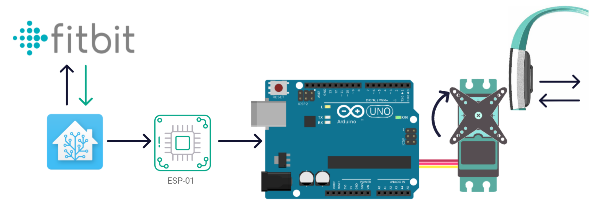
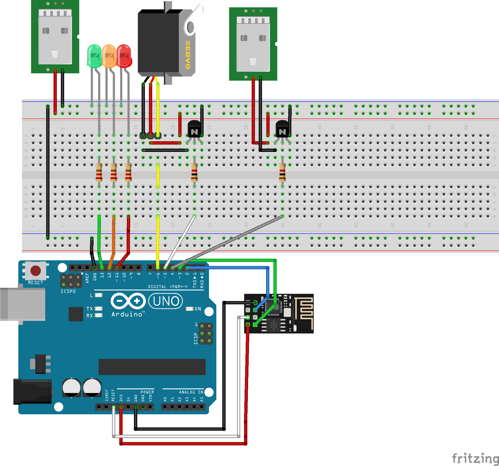

# Sitbit

My entire working and entertainment lifestyle typically demands that I remain in a permanently seated position at my desk only interrupted by desperate crawls toward the coffee machine. At the same time, my health insurance company insists on only increasing my allocated rewards when my step count matches that of your average jogger.

Fortunately, I’m also in a position to fix the problem… permanently. We’re going to create the Sitbit.

The complete project download can be found here: [https://github.com/TheLaurenBarger/gadget.sitbit](https://github.com/TheLaurenBarger/gadget.sitbit)

<!-- Table of Contents -->

## Requirements.
=============

The requirements for my device are as follows. If all of these requirements are met, I should realistically be able to leave the Sitbit in an abandoned cupboard and be freed from the responsibility of earning steps for the rest of time.

1.  Track steps on a platform recognized by Discovery.
2.  Actuate the tracker to realistically simulate steps.
3.  Automatically charge the tracker in between “walks”.
4.  Operate the device on an intelligently timed basis.
    

A few secondary requirements:

1.  Reduced circuit footprint.
2.  Home assistant integration.
3.  Stop charging after device is fully charged.
    

Step Counter.
-------------

For the step counter of choice, I’ll be using a Fitbit Charge 2. It’s an accepted tracker with Discovery, and I happen to know how to fool it. It also has the added advantage of a fantastic web interface we might be able to use later.

Actuation.
----------

The particular Fitbit I have is easily fooled by rocking the watch face in a pendulum motion. To achieve this a simple motor knocking against the watch face should work for simulating our steps.

Charging.
---------

The Fitbit Charge 2 has a snap on charging clip and uses a standard USB 5W supply. Conveniently, so do the majority of the other components I’ll require (motor, Arduino). Something to consider, is whether or not it’s necessary to still use the supplied charge in favour of rather attaching wires directly to the battery terminal.

The decision will depend on whether or not the walking performance is affected by the weight of the charging clip.

Operation.
----------

The majority of the logic controlling the device will be coded on an Arduino. However I believe it’s worth mentioning a few of the secondary requirements here.

The way I envision the device working is to have it cycle through different operating modes:

1.  **Walk:** In this mode, the motor is knocking the watch face and simulating walking.
2.  **Charge:** Power is diverted from the motor to the watch charging holster to ensure it’s ready for the following day’s walk.
3.  **Idle (Optional):** Once the FitBit is charged, the power is cut off to prevent the device from over charging. This requirement is optional however, as the charge input might not cause any damage to the watch with over charging.
    

Obviously, these modes can be timed switches which we could configure via the Arduino. However, I’m slowly working on converting the majority of my little flat to a Smart Home. It seems a shame not to leverage Home Assistant to more intelligently control this device.

Home Assistant integration.
---------------------------

The idea is that the Arduino controller interfaces with Home Assistant via MQTT with an ESP-01 chip flashed with Tasmota as a WIFI interface. Home Assistant can interface with the FitBit website and display the current step count for a user. We could have Home Assistant send a timed message to the ESP-01 chip to begin the daily walk. Once Home Assistant detects that 10 000 steps have been reached on the FitBit interface, a second message could be sent to switch the device into charging mode.

Stopping the charging cycle once the device is fully charged would most likely be triggered by the Arduino as it requires detection on the circuit itself. At this point a message will be sent to Home Assistant to update the Walker state for Home Assistant.

Questions:

*   Should the device only enter walking mode when it’s in idle mode?
    
*   Can the FitBit integration on home assistant monitor the charge state and therefore control the Walker idle mode as well?
    

If all goes well, the general blocked out design fits together something like this:

Components.
===========

For the development of the project I used the following.

1.  FitBit Charge 2
2.  FitBit Charge 2 Charging Holster
3.  Atmega328p Arduino Components:
    
    1. [ATmega328p](https://www.mantech.co.za/ProductInfo.aspx?Item=35M5059) \- R?
        
    2. [16MHz Crystal](https://www.mantech.co.za/ProductInfo.aspx?Item=65M1608-H) - R2.46
        
    3. [10KΩ Resistor](https://www.mantech.co.za/ProductInfo.aspx?Item=72M0864) - R0.38
        
    4. [22pF Capacitor](https://www.mantech.co.za/ProductInfo.aspx?Item=72M1619) x2 - R0.22
        
    5. [10uF Capacitor](https://www.mantech.co.za/ProductInfo.aspx?Item=72M0894) - R1.12
        
4.  Motor Components:
    
    1. [Continuous Rotation Servo Motor](https://www.mantech.co.za/ProductInfo.aspx?Item=15M8959) - R125.82
        
    2.  Dual arm rotor attachment (supplied with motor)
        
    3.  10mm M2 Screws x4 (supplied with motor)
        
    4.  Shock absorber screw mounts (supplied with motor)
        
    5.  20 x 40mm Shock absorber felt
        
5. [ESP-01 WIFI Module](https://www.mantech.co.za/ProductInfo.aspx?Item=15M0866) - R64.43
6. [Strip board](https://www.mantech.co.za/productinfo.aspx?item=14M8247) - R24.24
7.  Transistor NPM - R?
8.  220Ω Resistor x4 - R?
9.  1kΩ Resistor - R?
10.  2.2kΩ Resistor - R?
11.  Cables
12.  Header pins
    

These components were used to develop the project.

1.  Prusa Mini 3D Printer
2.  PLA Filament
3.  Soldering Iron
4.  Solder
5. [Arduino UNO Development Board](https://www.takealot.com/arduino-uno-r3-compatible/PLID38534309) - R310.00
6.  ATmega328p Flashing Components:
    
    1. [FTDI Adapter](https://www.mantech.co.za/ProductInfo.aspx?Item=15M0301-A) - R76.72
        
    2. [100nF Capacitor](https://www.mantech.co.za/ProductInfo.aspx?Item=13M2293-A) - R0.36
        

Walker design.
==============

I used Blender to design the 3D printable walker structure. The STL and Blender files are included in the project repo ([https://github.com/TheLaurenBarger/the-walker](https://github.com/TheLaurenBarger/the-walker)). The overall structure looks as follows:

<image>

Motor housing.
--------------

The continuous rotation servo motor slots into place in this section of the Walker. The motor blades will spin from this point to knock the watch face. The motor is fastened to the holster via four M2 screws as indicated below:

<image>

The motor cables can be run out and through the channel beneath the housing which route to the circuit mount point.

<image>

Watch holster.
--------------

The watch itself fits into the Walker by fastening the one half of the FitBit strap with adjustment holes in the band into the following section of the Walker:

<image>

This should exactly place the watch face in line with the rotor blades on the motor. The FitBit charging cable can be routed through the upper cable feed point in the back of the Walker:

<image>

LED state indicators:
---------------------

The current state of the Walker will be indicated by one of three LEDs mounted in the face of the holster (green for walking, yellow for charging, red for idling).

<image>

The cables for these LEDs can be routed through the lower cable feed point in the back of the Walker.

<image>

Circuit mount point.
--------------------

The completed circuit can be mounted at the back face of the structure here:

<image>

It has incoming slots available for the motor cables to feed through as well as the charging cable for the FitBit and LED indicator wires:

<image>

Initial assembly.
=================

The assembly instructions are going to be in two parts. Firstly, I’ll will assemble the basic components and test our circuit and code with a breadboard mount and jumper cables. Once everything is working as expected, the circuit and code will be migrated to a standalone ATmega328 chip instead of the UNO development board.

Motor Assembly:
---------------

1.  Attach the double arm rotor to the motor.  
    <image>
2.  Add those vibration shock thingies to the motor mount points?  
    <image>
3.  Optionally, cut the shock absorber felt to size?  
    <image>
4.  Add shock absorber cloth beneath the motor?  
    <image>
5.  Slot the motor into the Walker structure so that the rotor is on the right hand side of the structure, and the cables fit into the cable channel.  
    <image>
6.  Screw the motor in place with the four 10mm M2 screws supplied with the motor.  
    <image>
7.  Feed the motor cables into the channel beneath the housing.  
    <image>
    

Watch mount.
------------

1.  The elasticity of the FitBit strap is conveniently perfect for the knocking action we’re looking for. Remove the part of the watch strap with the buckle and leave only the half with length adjustment holes.  
    <image>
2.  The adjustment holes will align with the slots in the watch bed and will hold the watch face in place. Place the hole closest to the watch face around the slot closest to the motor housing on the Walker.
    
    <image>
3.  The face should be dangling just above and centered to the motor blades.
    
    <image>
    

Breadboard circuit.
-------------------

Circuit.

1.  Configure ESP-01S
    
    1.  Flash Tasmota
        
    2.  Configure MQTT Integration
        
2.  Assemble Circuit
    
    1.  Motor Circuit
        
    2.  Charging Circuit
        
    3.  LED rig
        
3.  Connect ESP-01S
4.  Flash Arduino script
5.  Intermediate Test
6.  Mount on vero board
    
    1.  ESP-01S Power Supply
        

Device configuration.
=====================

MQTT Integration.
-----------------

For controlling the device, we will flash the ESP-01S with Tasmota and connect it to our home MQTT broker network.

For details on flashing and configuring Tasmota on the ESP-01S, refer to the following:

[Tasmota: Setup and Initial Configuration.](8290305.html)

[Tasmota: Configuring MQTT Integration](10846209.html)

For the Sitbit configuration, my settings are as follows:

*   **Host**: MQTT Broker Host IP
    
*   **Port**: 1883
    
*   **Client**: sitbit
    
*   **Username**: sitbit
    
*   **Password**: sitbit user password
    
*   **Topic**: /misc/sitbit/%prefix%/
    

[Tasmota: Serial Communication with Arduino](11763713.html)

Conclusion.
===========

We’ve created an extremely permanent solution to monitored exercise. So far it’s working just fine.

References.
===========

1. [https://dronebotworkshop.com/arduino-uno-atmega328/](https://dronebotworkshop.com/arduino-uno-atmega328/)
2. [https://www.instructables.com/Getting-Started-With-the-ESP8266-ESP-01/](https://www.instructables.com/Getting-Started-With-the-ESP8266-ESP-01/)
3. [https://www.mantech.co.za](https://www.mantech.co.za/Categories.aspx)
4. [http://ota.tasmota.com/tasmota/release/](http://ota.tasmota.com/tasmota/release/)
5. [https://iotdesignpro.com/projects/getting-started-with-tasmota-on-esp8266-01-integrate-tasmota-with-home-assistant](https://iotdesignpro.com/projects/getting-started-with-tasmota-on-esp8266-01-integrate-tasmota-with-home-assistant)
6. [Tasmota: Serial Communication with Arduino](11763713.html)